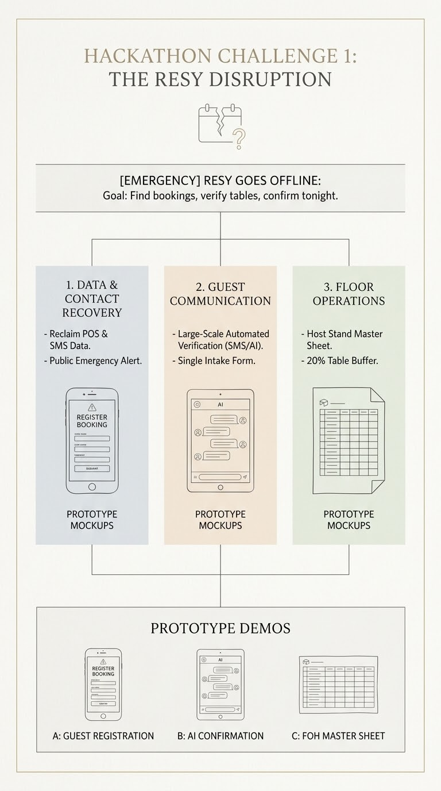

# Resy Goes Offline: Host Stand Prototype

**Live demo:** https://claude.ai/artifact/6nJLPbVyaKm9xERGnJzfbZ

## All three hackathon prototypes

- [Lume Host Stand](https://claude.ai/artifact/6nJLPbVyaKm9xERGnJzfbZ) (Challenge 1: Resy goes offline, host stand floor plan) · [repo](https://github.com/mz462/resy-offline-host-stand)
- [Final Buzzer Map](https://claude.ai/artifact/PpAobzRDSrPcYSV9ptZ5Ev) (Challenge 2: MSG egress planner) · [repo](https://github.com/mz462/final-buzzer-map)
- [Delta911](https://claude.ai/artifact/2hJqrzwKqr1ZJniXYSiiLw) (Challenge 3: 911 call-surge triage) · [repo](https://github.com/mz462/delta911)

Plug and Play x PMAI Hackathon, Rapid Fire Challenge 1.

Resy went down in the early afternoon. This prototype lets a restaurant manager run tonight's two seatings (6:00 PM and 8:30 PM) on a clickable 12-table floor plan:

- Guest list recovered from Resy confirmation emails, with duplicate detection
- Pick a guest, click a table to hold it, then send a (simulated) SMS confirmation
- Replies come back as confirmed, cancelled (table released), or no reply (call the guest)
- Walk-in seating, a per-seating summary bar, and a copyable host sheet as a paper backup

Open `index.html` in a browser. No build step.

